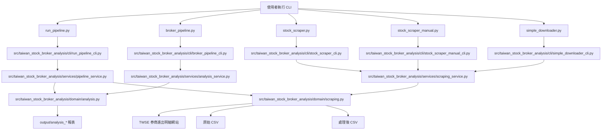

# 專案架構

這個專案目前分成四層：

1. `src/taiwan_stock_broker_analysis/cli/` 放參數解析與互動入口
2. `src/taiwan_stock_broker_analysis/services/` 放流程編排與應用服務
3. `src/taiwan_stock_broker_analysis/domain/` 放業務規則對外邊界
4. 專案根目錄的 `.py` 檔案保留為相容入口

## Mermaid 圖

## 目錄責任

### `src/taiwan_stock_broker_analysis/cli/`
- 負責 CLI 參數解析、輸入驗證、互動提示
- 不直接放分析或下載細節

### `src/taiwan_stock_broker_analysis/services/`
- 負責 workflow 與 use case 編排
- 例如把「下載後分析」串成同一個流程

### `src/taiwan_stock_broker_analysis/domain/`
- 提供分析規則與下載規則的穩定邊界
- 讓上層不用直接依賴底層模組細節

### `src/taiwan_stock_broker_analysis/analysis/core.py`
- 負責資料讀取、展平、母券商正規化、分群統計
- 負責均價法與 FIFO 損益計算
- 負責 step1 到 step7 報表輸出

### `src/taiwan_stock_broker_analysis/scraping/core.py`
- 負責 TWSE 表單流程
- 負責驗證碼圖片下載與 CSV 下載
- 負責原始 CSV / 處理後 CSV 儲存
- 負責簡要券商摘要輸出

### `src/taiwan_stock_broker_analysis/pipeline.py`
- 保留為相容匯入點
- 真正 workflow 已移到 `services/pipeline_service.py`

### 根目錄 CLI
- `run_pipeline.py`: 一鍵下載 + 分析
- `broker_pipeline.py`: 對既有 CSV 直接分析
- `stock_scraper.py`: OCR 驗證碼下載器
- `stock_scraper_manual.py`: 手動驗證碼下載器
- `simple_downloader.py`: 最小化下載器

## 設計原則

1. `src/` 內才是單一真實實作來源
2. 根目錄腳本只做相容轉發
3. `cli -> services -> domain` 只往下依賴
4. 分析規則與下載規則分離，避免再次交叉複製