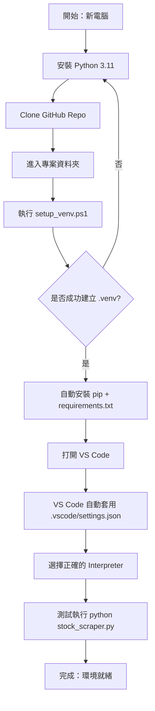

# Taiwan Stock Broker Analysis

台灣證券交易所券商進出明細爬蟲工具  
自動下載指定股票代號的券商進出明細，輸出 UTF-8 CSV，可直接用 Excel 開啟。  

---

## 📖 專案簡介

本專案提供一個簡單的 Python 工具，從 **台灣證券交易所公開資訊** 抓取券商買賣超明細，支援輸入股票代號（例如 2317 鴻海、2330 台積電），並將結果存成 CSV。  

特色功能：
- 📝 輸入股票代號 → 自動下載當日券商進出明細  
- 📊 輸出 UTF-8 CSV，可直接用 Excel 開啟  
- 🔍 使用 BeautifulSoup + Requests 解析網頁資料  
- ⚙️ 模組化程式設計，方便擴充  

---

## 🚀 環境建置

### 1. Clone Repo
```powershell
git clone https://github.com/sheng-luen-chung/taiwan-stock-broker-analysis.git
cd taiwan-stock-broker-analysis
````

### 2. 一鍵建立虛擬環境（Windows）

```powershell
powershell -ExecutionPolicy Bypass -File .\setup_venv.ps1
```

### 3. 啟用虛擬環境

```powershell
.\.venv\Scripts\Activate.ps1
```

### 4. 安裝套件（如果需要手動）

```powershell
pip install -r requirements.txt
```

---

## 🖥️ 環境建置流程圖



---

## 📦 使用方式

### 互動式輸入股票代號

```powershell
python stock_scraper.py
```

出現提示後輸入代號（例如 2330），即會下載當日券商進出明細。

### 直接指定股票代號（若程式支援）

```powershell
python stock_scraper.py 2330
```

輸出檔案會存在 `output/` 目錄，檔名格式類似：

```
broker_2330_2025-09-08.csv
```

---

## 🛠️ 專案結構

```
taiwan-stock-broker-analysis/
├─ .vscode/              # VS Code 設定（固定使用 .venv）
│   └─ settings.json
├─ .gitignore            # Git 忽略規則
├─ requirements.txt      # 套件需求
├─ setup_venv.ps1        # 一鍵建立環境腳本 (Windows)
├─ stock_scraper.py      # 主程式：爬取券商進出明細
├─ check_installation.py # 環境檢查工具
└─ output/               # 輸出 CSV 檔
```

---

## 🤝 貢獻規範

1. Fork 專案 & 建立 feature branch

   ```bash
   git checkout -b feature/new-feature
   ```
2. 提交修改 & 撰寫清楚的 commit message

   ```bash
   git commit -m "feat: 新增券商篩選功能"
   ```
3. Push 到自己的 fork，並發 Pull Request

   ```bash
   git push origin feature/new-feature
   ```

---

## 📜 授權

本專案採用 [MIT License](LICENSE) 授權，歡迎自由使用與修改。
